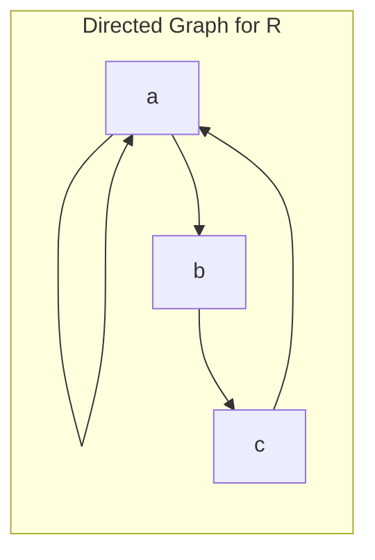
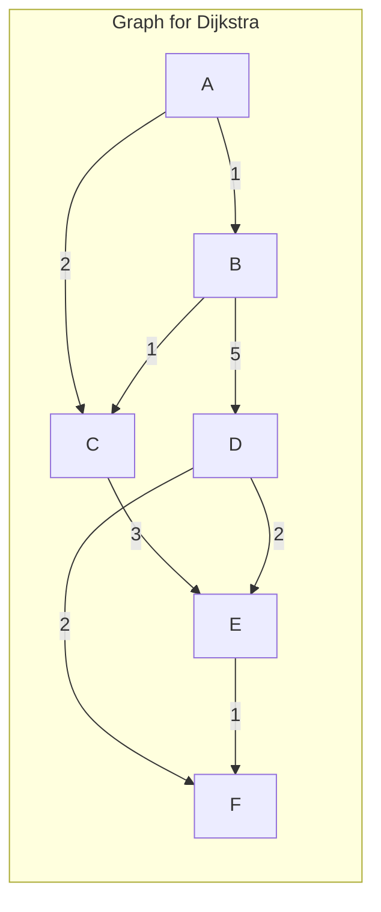

# Discrete Mathematics Assignments

## Assignment 1: Set Theory and Mathematical Induction

### Question 1

Out of integers 1 to 2000:

i) How many are not divisible by 2, nor by 3, nor by 5?

ii) How many are not divisible by 3 and 5 but divisible by 2?

**Aim:** To solve problems based on the Principle of Inclusion-Exclusion.

**Objective:**
*   To understand and apply the Principle of Inclusion-Exclusion.
*   To solve counting problems involving divisibility.

**Theory:**
The Principle of Inclusion-Exclusion is a counting technique which generalizes the familiar method of obtaining the number of elements in the union of two finite sets. For three sets A, B, and C, the principle states:

$|A \cup B \cup C| = |A| + |B| + |C| - |A \cap B| - |A \cap C| - |B \cap C| + |A \cap B \cap C|$

**Solution:**
Let S be the set of integers from 1 to 2000. $|S| = 2000$.
Let A be the set of integers divisible by 2, B be the set divisible by 3, and C be the set divisible by 5.

$|A| = \lfloor 2000/2 \rfloor = 1000$
$|B| = \lfloor 2000/3 \rfloor = 666$
$|C| = \lfloor 2000/5 \rfloor = 400$
$|A \cap B| = \lfloor 2000/6 \rfloor = 333$
$|A \cap C| = \lfloor 2000/10 \rfloor = 200$
$|B \cap C| = \lfloor 2000/15 \rfloor = 133$
$|A \cap B \cap C| = \lfloor 2000/30 \rfloor = 66$

i) Number of integers not divisible by 2, 3, or 5 is $|S| - |A \cup B \cup C|$.
$|A \cup B \cup C| = 1000 + 666 + 400 - 333 - 200 - 133 + 66 = 1466$
Number of integers not divisible = $2000 - 1466 = 534$

ii) Number of integers not divisible by 3 and 5 but divisible by 2 is $|A| - |A \cap B| - |A \cap C| + |A \cap B \cap C|$.
$= 1000 - 333 - 200 + 66 = 533$

**Conclusion:**
We have successfully applied the Principle of Inclusion-Exclusion to solve the given counting problems.

### Question 2

By using mathematical induction show that: $1^2 + 2^2 + 3^2 + ... + n^2 = \frac{n(n + 1)(2n + 1)}{6}$ for all natural number values of n.

**Aim:** To prove the formula for the sum of the first n squares using mathematical induction.

**Objective:**
*   To understand the principle of mathematical induction.
*   To apply mathematical induction to prove a summation formula.

**Theory:**
Mathematical induction is a mathematical proof technique used to prove a given statement about any well-ordered set. The proof consists of two steps:
1.  **Base Case:** Show that the statement holds for the first element of the set.
2.  **Inductive Step:** Assume the statement holds for some arbitrary element, and then show that it also holds for the next element.

**Proof:**
**Base Case (n=1):**
LHS = $1^2 = 1$
RHS = $1(1+1)(2*1+1)/6 = 1*2*3/6 = 1$
LHS = RHS, so the base case holds.

**Inductive Step:**
Assume the formula is true for n=k:
$1^2 + 2^2 + ... + k^2 = k(k+1)(2k+1)/6$

Now, we need to prove it for n=k+1:
$1^2 + 2^2 + ... + k^2 + (k+1)^2 = (k+1)(k+2)(2k+3)/6$

LHS = $(1^2 + 2^2 + ... + k^2) + (k+1)^2$
$= k(k+1)(2k+1)/6 + (k+1)^2$
$= (k+1) [k(2k+1)/6 + (k+1)]$
$= (k+1) [ (2k^2 + k + 6k + 6) / 6 ]$
$= (k+1) [ (2k^2 + 7k + 6) / 6 ]$
$= (k+1) [ (k+2)(2k+3) / 6 ]$
$= (k+1)(k+2)(2k+3)/6 = RHS$

**Conclusion:**
Since the base case and the inductive step have been proved, the formula holds for all natural numbers n.

## Assignment 2: Trees and Graph Isomorphism

### Question 1

Explain Binary Search Tree (BST) with a suitable example. Construct a Binary Search Tree using the following elements: K, T, B, N, R, D, F, U, A, G, O, S

**Aim:** To understand and construct a Binary Search Tree (BST).

**Objective:**
*   To learn the properties of a BST.
*   To practice inserting elements into a BST.

**Theory:**
A Binary Search Tree is a node-based binary tree data structure which has the following properties:
*   The left subtree of a node contains only nodes with keys lesser than the node’s key.
*   The right subtree of a node contains only nodes with keys greater than the node’s key.
*   The left and right subtree each must also be a binary search tree.

**Solution:**
The BST is constructed by inserting the elements one by one. The final tree structure is described as follows:
*   Root: K
*   K's left child: B, K's right child: T
*   B's left child: A, B's right child: D
*   T's left child: N, T's right child: U
*   D's right child: F
*   N's right child: R
*   F's right child: G
*   R's left child: O, R's right child: S

### Question 2

Consider the two graphs, G1 and G2, below. Determine whether or not G1 and G2 are isomorphic. If they are isomorphic, give a function g:V(G1) -> V(G2) that defines the isomorphism. If they are not, explain why they are not.

**Aim:** To determine if two graphs are isomorphic.

**Objective:**
*   To understand the concept of graph isomorphism.
*   To identify properties preserved by isomorphism.
*   To find an isomorphism between two graphs or prove that none exists.

**Theory:**
Two graphs G1 and G2 are isomorphic if there exists a one-to-one and onto function f from the vertex set of G1 to the vertex set of G2 such that any two vertices u and v of G1 are adjacent in G1 if and only if f(u) and f(v) are adjacent in G2. Such a function f is called an isomorphism. Isomorphic graphs must have the same number of vertices, the same number of edges, and the same degree sequence.

**Solution:**
Let's analyze the two graphs shown in the second problem of the image from Assignment 5.
*   Both graphs have 6 vertices and 9 edges.
*   The degree sequence for both graphs is (3, 3, 3, 3, 3, 3). Both are 3-regular graphs.
*   The first graph (G1) is the complete bipartite graph $K_{3,3}$. It is bipartite and thus has no odd-length cycles.
*   The second graph (G2) is the prism graph. It contains several triangles (cycles of length 3), for example, the cycle (1,2,4).

Since G1 does not have any cycles of odd length and G2 has cycles of length 3, the graphs cannot be isomorphic.

**Conclusion:**
The two graphs are not isomorphic because G1 is bipartite and has no odd cycles, while G2 contains triangles (cycles of length 3), which is a structural property not shared between them.

## Assignment 3: Combinatorics

### Question 1

How many 3-digit numbers can be formed using the digits 1, 3, 5, 6, 8, and 9, if repetition of digits is not allowed?
i) How many of these numbers are greater than 700?
ii) How many are even?
iii) How many are divisible by 3?
iv) How many are odd?
v) How many have the digit 5 in the tens place?

**Aim:** To solve counting problems using permutations and combinations.

**Objective:**
*   To apply the rules of counting for arrangements without repetition.
*   To solve conditional counting problems.

**Theory:**
The number of permutations of n distinct objects taken r at a time is given by $P(n,r) = \frac{n!}{(n-r)!}$. This is used when order matters and there is no repetition.

**Solution:**
The set of digits is S = {1, 3, 5, 6, 8, 9}. Total 6 digits.
Total 3-digit numbers = $P(6,3) = 6 * 5 * 4 = 120$.
i) **Greater than 700:** First digit must be 8 or 9 (2 choices). Remaining 2 digits from 5 in $P(5,2) = 20$ ways. Total = $2 * 20 = 40$.
ii) **Even:** Last digit must be 6 or 8 (2 choices). For each, the first 2 digits can be chosen from the remaining 5 in $P(5,2) = 20$ ways. Total = $2 * 20 = 40$.
iii) **Divisible by 3:** Sum of digits must be divisible by 3. Combinations of 3 digits from S with sum divisible by 3 are: {3,6,9}, {1,5,3}, {1,5,6}, {1,5,9}, {1,8,3}, {1,8,6}, {1,8,9}. Each of these 7 sets can form $3! = 6$ numbers. Total = $7 * 6 = 42$.
iv) **Odd:** Last digit is 1, 3, 5, or 9 (4 choices). Total = $4 * P(5,2) = 4 * 20 = 80$.
v) **Digit 5 in tens place:** Tens digit is 5. The other 2 digits from remaining 5 in $P(5,2) = 20$ ways. Total = 20.

**Conclusion:**
We have solved various counting problems based on permutations.

### Question 2

How many different seven-person committees can be formed if each committee must contain 4 women chosen from 22 women and 3 men chosen from 28 men?

**Aim:** To solve a counting problem involving combinations.

**Objective:**
*   To apply the combination formula.

**Theory:**
The number of combinations of n objects taken r at a time is $C(n,r) = \binom{n}{r} = \frac{n!}{r!(n-r)!}$.

**Solution:**
Ways to choose 4 women from 22: $\binom{22}{4} = 7315$.
Ways to choose 3 men from 28: $\binom{28}{3} = 3276$.
Total committees = $\binom{22}{4} * \binom{28}{3} = 7315 * 3276 = 23,967,460$.

**Conclusion:**
The total number of different committees is 23,967,460.

## Assignment 4: Posets and Relations

### Question 1

Let A = {1, 2, 3, 4, 6, 8, 12} and let R be the relation on A defined by aRb if "a divides b".
*   Prove that (A, R) is a partially ordered set.
*   Draw the Hasse diagram for this relation.
*   Is this a lattice? Justify your answer.

**Aim:** To analyze a partially ordered set.

**Objective:**
*   To understand posets and Hasse diagrams.
*   To determine if a poset is a lattice.

**Theory:**
A poset is a set with a relation that is reflexive, antisymmetric, and transitive. A lattice is a poset where every pair of elements has a unique LUB and GLB.

**Solution:**
**Poset proof:** R is a partial order as divisibility is reflexive, antisymmetric, and transitive on positive integers.

**Hasse Diagram:**
```mermaid
graph TD;
    subgraph Hasse Diagram for (A, |);
        1 --> 2;
        1 --> 3;
        2 --> 4;
        2 --> 6;
        3 --> 6;
        4 --> 8;
        4 --> 12;
        6 --> 12;
    end
```

**Lattice check:**
Consider the pair {8, 12}.
GLB(8,12) = GCD(8,12) = 4, which is in A.
LUB(8,12) = LCM(8,12) = 24, which is not in A.
Since not every pair has a LUB in A, it is not a lattice.

**Conclusion:**
(A, R) is a poset but not a lattice.

### Question 2

Let S = {a, b, c}. R = {(a, a), (a, b), (b, c), (c, a)}.
*   Represent R as a matrix and a directed graph.
*   Find the reflexive, symmetric, and transitive closures of R.

**Aim:** To represent relations and find their closures.

**Objective:**
*   To use matrix and graph representations for relations.
*   To compute relation closures.

**Theory:**
Reflexive closure $r(R) = R \cup \Delta$. Symmetric closure $s(R) = R \cup R^{-1}$. Transitive closure $t(R) = R \cup R^2 \cup ...$.

**Solution:**
**Matrix:**
$M_R = \begin{pmatrix} 1 & 1 & 0 \\ 0 & 0 & 1 \\ 1 & 0 & 0 \end{pmatrix}$

**Directed Graph:**


**Closures:**
*   $r(R) = R \cup {(b,b), (c,c)}$
*   $s(R) = R \cup {(b,a), (c,b), (a,c)}$
*   $t(R) = S * S = {(x,y) | x,y \in S}$

**Conclusion:**
The relation has been represented and its closures computed.

## Assignment 5: Graph Algorithms

### Question 1

Use Dijkstra's algorithm to find the shortest path between A and F in the figure.

**Graph:**


**Aim:** To find the shortest path in a weighted graph.

**Objective:**
*   To apply Dijkstra's algorithm.

**Theory:**
Dijkstra's algorithm finds the shortest paths from a source to all other vertices in a weighted graph with non-negative edge weights.

**Solution:**
Running Dijkstra's from source A:
1.  dist(A)=0, others=inf.
2.  Visit A: dist(B)=1, dist(C)=2.
3.  Visit B: dist(C)=min(2, 1+1)=2. dist(D)=6.
4.  Visit C: dist(E)=5.
5.  Visit E: dist(F)=6.
6.  Visit D: No change to F's distance.

Shortest path to F is 6. The path is A -> C -> E -> F.

**Conclusion:**
The shortest path from A to F is A -> C -> E -> F with weight 6.

### Question 2

Consider the two graphs, G1 and G2, below. Determine whether or not G1 and G2 are isomorphic. If they are isomorphic, give a function g:V(G1) -> V(G2) that defines the isomorphism. If they are not, explain why they are not.

**Graphs for Isomorphism**

**G1 (K3,3)**
```mermaid
graph;
    subgraph "G1";
        a --- b;
        a --- d;
        a --- f;
        c --- b;
        c --- d;
        c --- f;
        e --- b;
        e --- d;
        e --- f;
    end
```

**G2 (Prism Graph)**
```mermaid
graph;
    subgraph "G2";
        1 --- 2;
        2 --- 3;
        3 --- 1;
        4 --- 5;
        5 --- 6;
        6 --- 4;
        1 --- 4;
        2 --- 5;
        3 --- 6;
    end
```

**Aim:** To determine if two graphs are isomorphic.

**Objective:**
*   To understand the concept of graph isomorphism.
*   To identify properties preserved by isomorphism.
*   To find an isomorphism between two graphs or prove that none exists.

**Theory:**
Two graphs G1 and G2 are isomorphic if there exists a one-to-one and onto function f from the vertex set of G1 to the vertex set of G2 such that any two vertices u and v of G1 are adjacent in G1 if and only if f(u) and f(v) are adjacent in G2. Such a function f is called an isomorphism. Isomorphic graphs must have the same number of vertices, the same number of edges, and the same degree sequence.

**Solution:**
Let's analyze the two graphs.
*   Both graphs have 6 vertices and 9 edges.
*   The degree sequence for both graphs is (3, 3, 3, 3, 3, 3). Both are 3-regular graphs.
*   The first graph (G1) is the complete bipartite graph $K_{3,3}$. It is bipartite and thus has no odd-length cycles.
*   The second graph (G2) is the prism graph. It contains several triangles (cycles of length 3), for example, the cycle (1,2,4).

Since G1 does not have any cycles of odd length and G2 has cycles of length 3, the graphs cannot be isomorphic.

**Conclusion:**
The two graphs are not isomorphic because G1 is bipartite and has no odd cycles, while G2 contains triangles (cycles of length 3), which is a structural property not shared between them.

## Assignment 6: Trees and Graph Algorithms

### Question 1

Explain Binary Search Tree (BST) with a suitable example. Construct a Binary Search Tree using the following elements: K, T, B, N, R, D, F, U, A, G, O, S

**Aim:** To understand and construct a Binary Search Tree (BST).

**Objective:**
*   To learn the properties of a BST.
*   To practice inserting elements into a BST.

**Theory:**
A Binary Search Tree is a node-based binary tree data structure which has the following properties:
*   The left subtree of a node contains only nodes with keys lesser than the node’s key.
*   The right subtree of a node contains only nodes with keys greater than the node’s key.
*   The left and right subtree each must also be a binary search tree.

**Solution:**
The BST is constructed by inserting the elements one by one. The final tree structure is described as follows:
*   Root: K
*   K's left child: B, K's right child: T
*   B's left child: A, B's right child: D
*   T's left child: N, T's right child: U
*   D's right child: F
*   N's right child: R
*   F's right child: G
*   R's left child: O, R's right child: S

### Question 2

Find the minimum Spanning tree for the graph shown using Kruskal's algorithm.

**Graph:**
```mermaid
graph;
    subgraph "Graph for Kruskal's";
        A -- 4 --- B;
        A -- 4 --- C;
        B -- 2 --- C;
        B -- 3 --- D;
        B -- 7 --- E;
        C -- 1 --- D;
        D -- 4 --- E;
        D -- 2 --- F;
        E -- 3 --- F;
    end
```

**Aim:** To find the Minimum Spanning Tree (MST).

**Objective:**
*   To apply Kruskal's algorithm.

**Theory:**
Kruskal's algorithm is a greedy algorithm that finds an MST for a connected weighted graph by adding edges in increasing order of weight, avoiding cycles.

**Solution:**
Edges sorted by weight: (C,D,1), (B,C,2), (D,F,2), (B,D,3), (E,F,3), (A,B,4), (A,C,4), (D,E,4), (B,E,7).
MST construction:
1.  Add (C,D)
2.  Add (B,C)
3.  Add (D,F)
4.  Reject (B,D) (forms cycle)
5.  Add (E,F)
6.  Add (A,B)

MST edges: {(C,D), (B,C), (D,F), (E,F), (A,B)}. Total weight = 1+2+2+3+4 = 12.

**Conclusion:**
The MST was found with a total weight of 12.
